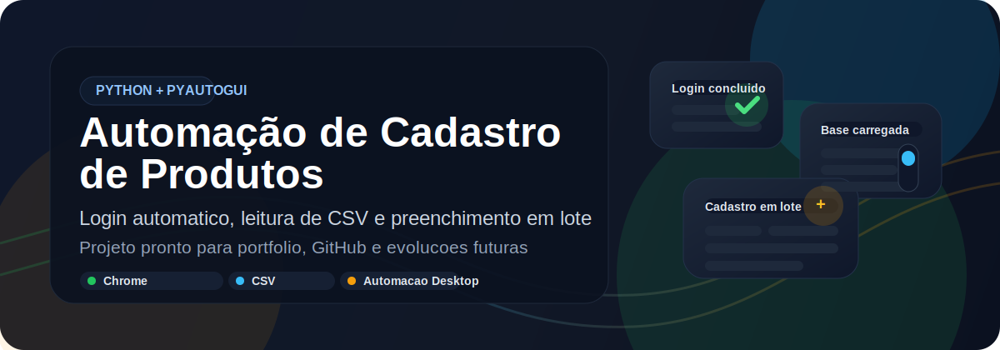

<p align="center">
  
</p>

# Automação de Cadastro de Produtos com Python

<p align="center">
  
  
  
  
</p>

<p align="center">
  Projeto de automação desktop com Python para acessar uma pagina web, fazer login automaticamente e cadastrar produtos em lote a partir de uma planilha CSV.
</p>

## Stack utilizada

<p align="center">
  
  
  
  
  
  
</p>

## O que este projeto faz

- Abre o Google Chrome automaticamente no macOS
- Acessa a tela de login do sistema
- Le email e senha a partir do arquivo `.env`
- Importa a base de produtos com `pandas`
- Preenche o formulario item por item com `PyAutoGUI`
- Mantem credenciais fora do GitHub

## Fluxo da automacao

<p align="center">
  
</p>

## Destaques do repositorio

- `codigo.py`: script principal da automacao
- `pegar_posicao.py`: captura coordenadas da tela para ajustar cliques
- `tabela.py`: validacao rapida da estrutura do CSV
- `produtos.csv`: base de exemplo para o cadastro em lote
- `.env.example`: modelo de configuracao local
- `requirements.txt`: dependencias do projeto

## Estrutura do projeto

```text
.
├── assets/
│   ├── banner.svg
│   └── workflow.svg
├── codigo.py
├── pegar_posicao.py
├── produtos.csv
├── tabela.py
├── requirements.txt
├── .env.example
└── README.md
```

## Como executar

### 1. Clone o repositorio

```bash
git clone <URL_DO_SEU_REPOSITORIO>
cd "AUTOMAÇAO PYTHON"
```

### 2. Crie e ative um ambiente virtual

```bash
python3 -m venv .venv
source .venv/bin/activate
```

### 3. Instale as dependencias

```bash
pip install -r requirements.txt
```

### 4. Configure as variaveis locais

Crie o arquivo `.env` com base no exemplo:

```bash
cp .env.example .env
```

Preencha com seus dados e, se necessario, ajuste as coordenadas:

```env
AUTOMACAO_EMAIL=seu_email@exemplo.com
AUTOMACAO_SENHA=sua_senha_aqui
CAMPO_EMAIL_X=564
CAMPO_EMAIL_Y=401
BOTAO_LOGIN_X=727
BOTAO_LOGIN_Y=568
CAMPO_FORM_X=534
CAMPO_FORM_Y=290
SCROLL_APOS_CADASTRO=5000
```

### 5. Descubra as coordenadas da tela

```bash
python3 pegar_posicao.py
```

Depois de executar, posicione o mouse sobre os elementos desejados e use as coordenadas exibidas no terminal para atualizar o `.env`.

### 6. Rode a automacao

```bash
python3 codigo.py
```

## Formato do CSV

O arquivo `produtos.csv` deve conter estas colunas:

```text
codigo | marca | tipo | categoria | preco_unitario | custo | obs
```

Exemplo de linhas:

```text
MOLO000251    Logitech    Mouse    1    25.95    6.50
CAHA000252    Hashtag     Camisa   2    25.00    11.00    Conferir estoque
```

Observacao: a base atual usa tabulacao como separador, e o script ja faz a leitura com `sep="\t"`.

## Cuidados importantes

- O projeto depende de coordenadas da tela e pode exigir ajuste conforme resolucao, escala e zoom.
- Evite mover mouse e teclado durante a automacao.
- O fluxo atual foi preparado para macOS por usar `open -a 'Google Chrome'`.
- O arquivo `.env` esta no `.gitignore`, entao suas credenciais nao vao para o GitHub.

## Proximas melhorias

- Substituir coordenadas fixas por reconhecimento de imagem
- Adicionar logs por etapa
- Validar dados antes do envio
- Criar tratamento de erros com mensagens mais claras

## Autor

Desenvolvido por Matheus com foco em automacao de tarefas repetitivas usando Python.
